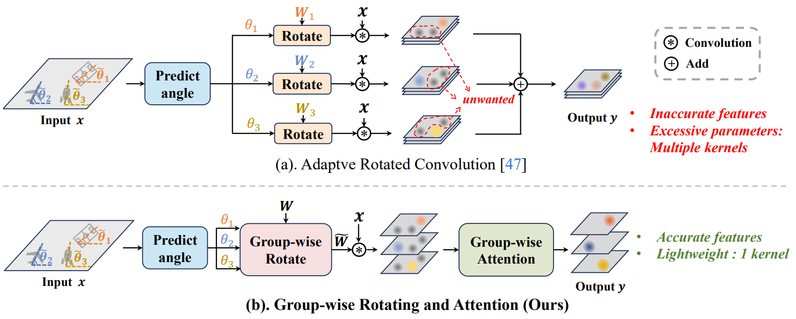
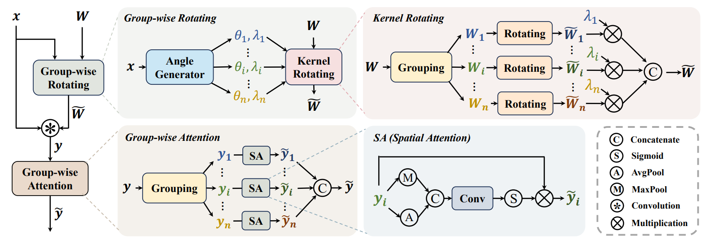

# GRA: Detecting Oriented Objects through Group-wise Rotating and Attention (ECCV 2024)


Authors: [Jiangshan Wang](https://scholar.google.com/citations?hl=en&user=HoKoCv0AAAAJ)\*, [Yifan Pu](https://github.com/yifanpu001/)\*,  [Yizeng Han](https://yizenghan.top/), [Jiayi Guo](https://www.jiayiguo.net/), [Yiru Wang](https://scholar.google.com/citations?user=Ug87_McAAAAJ&hl=zh-CN), [Xiu Li](https://scholar.google.com/citations?user=Xrh1OIUAAAAJ&hl=en&oi=ao)\#, [Gao Huang](http://www.gaohuang.net/)\#.

*: Equal contribution, #: Corresponding author.

## Introduction

This is the official implementation of the paper, *[GRA: Detecting Oriented Objects through Group-wise Rotating and Attention](https://arxiv.org/pdf/2403.11127)* (ECCV 2024). This paper presents novel Group-wise Rotating and Group-wise Spatial Attention machnisms to enhance the performance of oriented object detection.

### Motivation

<div align="center">
  
</div>


### Overall method

<div align="center">
  
</div>

## Get Started
The environment and data preprocessing can refer to the official repo of [ARC](https://github.com/LeapLabTHU/ARC).

You can get the pretrained weight of GRA-ResNet from [Google drive](https://drive.google.com/file/d/15wGWyPJPQF0ORV8LcPp5BWOtl7rW8ht5/view?usp=sharing)


## Usage

### Training

```
# train a Oriented R-CNN model with GRA-ResNet50 backbone
python tools/train.py configs/obb/gra/gra_orcnn_r50fpn1x_ss_dota10.py;
```

### Testing
```
python tools/test.py configs/obb/gra/gra_orcnn_r50fpn1x_ss_dota10.py \
YOUR_CHECKPOINT_PATH --format-only --options save_dir=YOUR_SAVE_DIR;
```

We provide the pretrained models as listed below.

| Detector  | Backbone | box AP | pretrained model |
| :---: | :---: | :---: | :---: |
| Oriented R-CNN | GRA-ResNet50  | 77.65 | [GoogleDrive](https://drive.google.com/file/d/16TkDn9Ddxmrbc0DJfz6c0YcNyUlnhBlw/view?usp=sharing) |


## Acknowledgement

This code is developed on the top of [ARC](https://github.com/LeapLabTHU/ARC/tree/main) and [LSKNet](https://github.com/zcablii/LSKNet), we thank to their efficient and neat codebase.

## Citation

If you find our work is useful in your research, please consider citing:

```
@article{wang2024gra,
  title={GRA: Detecting Oriented Objects through Group-wise Rotating and Attention},
  author={Wang, Jiangshan and Pu, Yifan and Han, Yizeng and Guo, Jiayi and Wang, Yiru and Li, Xiu and Huang, Gao},
  journal={arXiv preprint arXiv:2403.11127},
  year={2024}
}
```

## Contact
The code in this repository is still being reorganized. Errors that may arise during the organizing process could lead to code malfunctions or discrepancies from the original research results. If you have any questions or concerns, please send email to [wjs23@mails.tsinghua.edu.cn](mailto:wjs23@mails.tsinghua.edu.cn).